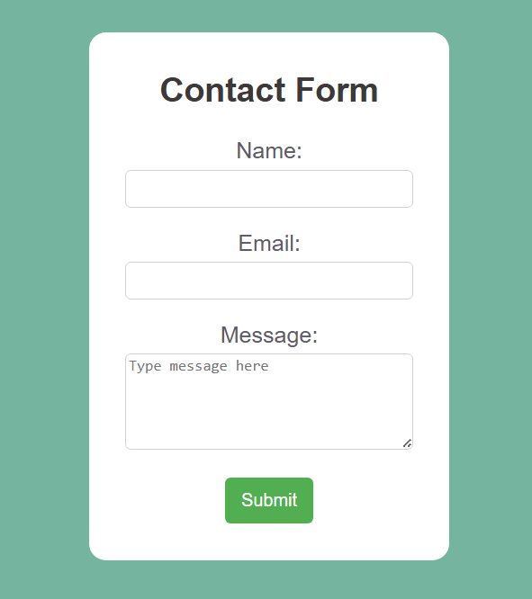

# Contact Form

A simple, responsive contact form with clean styling and form validation.

## Features

- Form validation using HTML5 `required` attributes
- Email format validation
- Styled input fields and textarea with focus states
- Responsive design with centered layout
- Clean, modern UI with rounded corners and soft color palette

## Technologies

- HTML5
- CSS3

## Form Fields

- **Name**: Text input (required)
- **Email**: Email input with validation (required)
- **Message**: Textarea for longer messages (required)

## Note

This is a front-end only form. The `action="#"` would need to be connected to a backend service to actually process form submissions.

## Screenshot:

