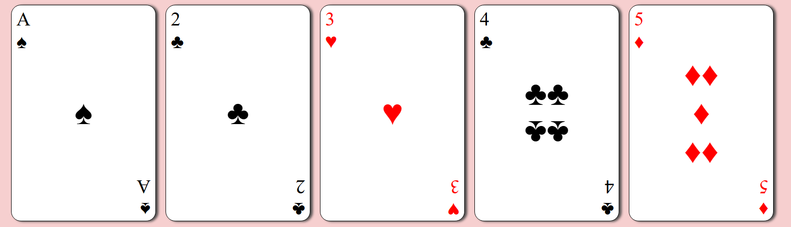

# Playing Cards

A set of 5 playing cards built with HTML and CSS to practice flexbox layout techniques.

## Features

- **Flexbox layout** - Cards are arranged in a responsive grid, and each card uses nested flexbox containers to position elements (top-left, center, bottom-right)
- **Card styling** - Red and black suits with inline styling for color variation
- **Rotation effects** - Bottom-right corner and some middle symbols are flipped using `transform: rotate(180deg)` to create authentic playing card design

## Technologies

- HTML5
- CSS3 (Flexbox)

## What I Learned

- How flex items can also be flex containers (nested flexbox)
- When to use `text-align` vs flexbox for centering
- Using `align-self` to position individual flex items

## Screenshot

